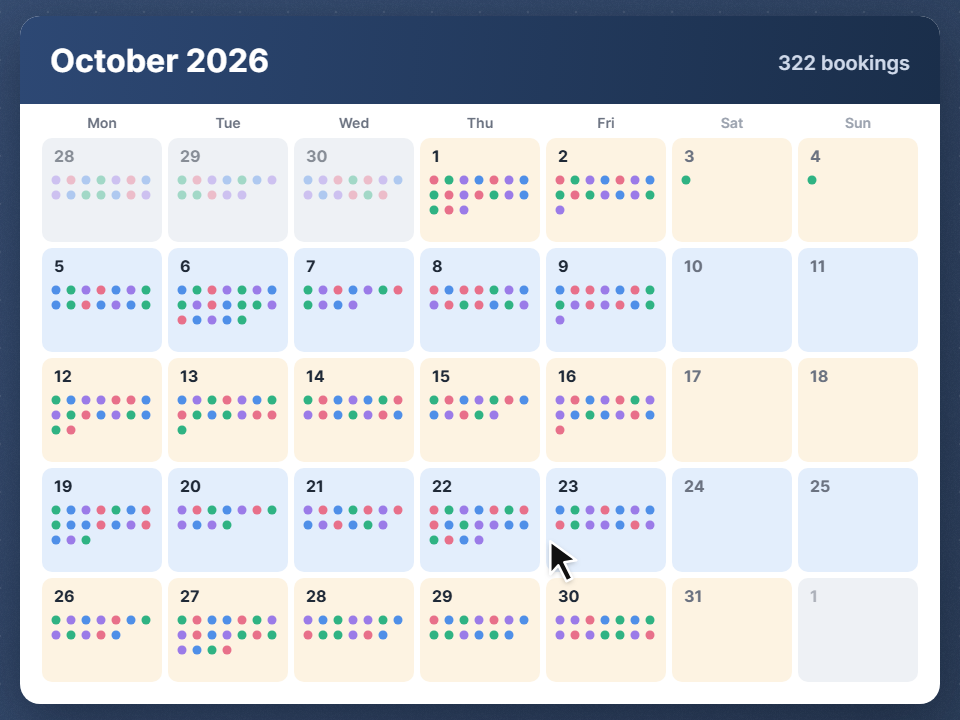
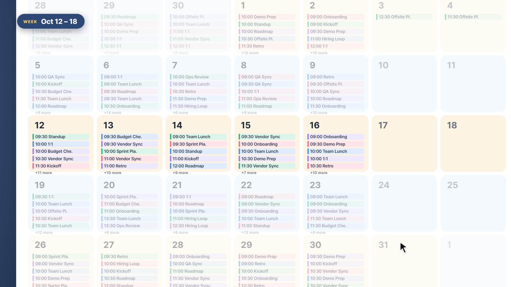
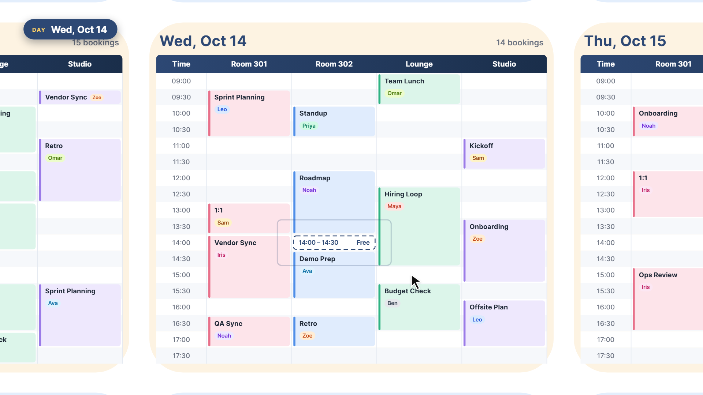
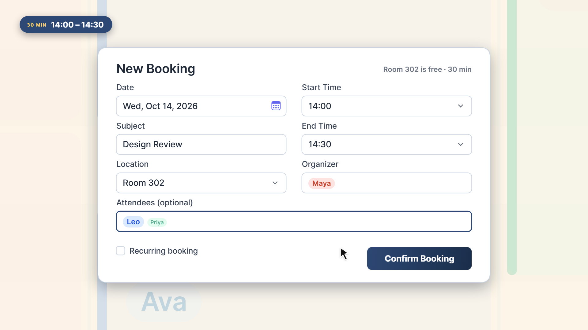
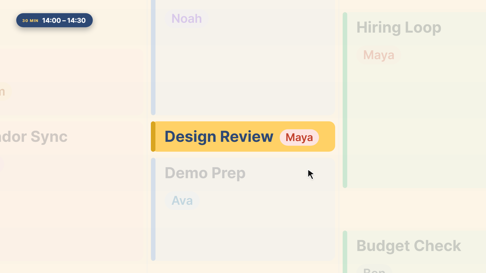

# 構想：從月到半小時的縮放檢視

> 狀態：**構想，未決定要做**。不是規格，還沒有對應的實作。
> 來源：2026-09-27 用 onetake skill 做介紹短片（概念 B「月到半小時」）時，為了畫面另外設計的檢視。
> 圖中資料全部是虛構的；會議室是短片自訂的 Room 301／Room 302／Lounge／Studio，不是正式的 6 間。

## 跟現況的差別

現在產品只有一種檢視：**週表**（表格，一列一筆預約，上一週／下一週／This Week 切換）。
下列畫面除了 04 的表單欄位以外，都是產品裡**沒有**的。

## 畫面

### 01 月總覽

- 一格一天，每筆預約是一個小點，點的顏色代表會議室，一眼就看得出哪幾天比較擠。
- 標題列顯示當月總預約數（例如 322 bookings）。
- 週末和當月以外的日期用淡色處理。

### 02 月曆展開

- 同一張月曆放大後，點會展開成「時間＋主題」的小字，每天超過的筆數收成 `+N more`。
- 選中的那一週會亮起來，其他週淡掉。

### 03 日檢視：會議室 × 半小時網格

- 橫軸是會議室，縱軸是半小時時段（09:00–17:30）。
- 每筆預約是一個色塊，顏色跟著會議室，塊裡寫主題和主辦人。
- 空檔用虛線框標成 `14:00 – 14:30 Free`，可以直接點。
- 左右兩側露出前一天和後一天，暗示可以左右滑動換日。

### 04 從空檔帶入的預約表單

- 從 03 點空檔進來，Date、Location、Start Time、End Time 自動帶入，右上角提示 `Room 302 is free · 30 min`。
- 欄位和現行 New Booking 表單相同，版面改成兩欄。

### 05 送出後落格

- 新預約以強調色（黃）落進那一格，周圍其他預約淡掉，讓人確認位置。
- 回到月總覽時，當天多一個點，總數 +1（322 → 323）。

## 導覽概念

月 → 週 → 日 → 半小時，一路點進去是**同一個畫面連續縮放**，不是換頁。
左上角有個尺度標籤（MONTH／WEEK／DAY／30 MIN），標示現在在哪一層。

## 要做之前得先決定

- 是否取代現行週表，還是並存（多一個切換）？
- 月總覽要一次讀整個月的預約，Supabase 查詢量和載入速度要評估。
- 日網格的欄數會跟著會議室數量變多（正式有 6 間），窄螢幕和手機要怎麼排？
- 從空檔帶入表單時，同樣要走現有的三層防撞（見 CLAUDE.md「時段防撞」）。
